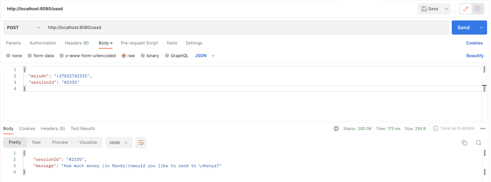
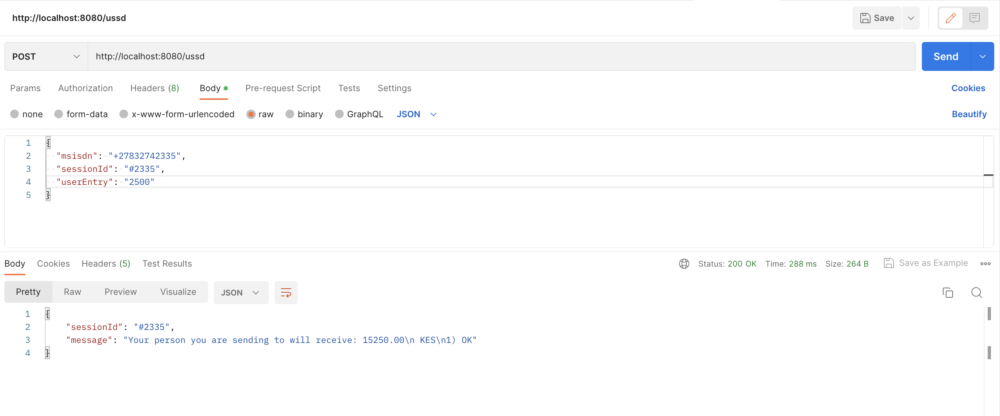
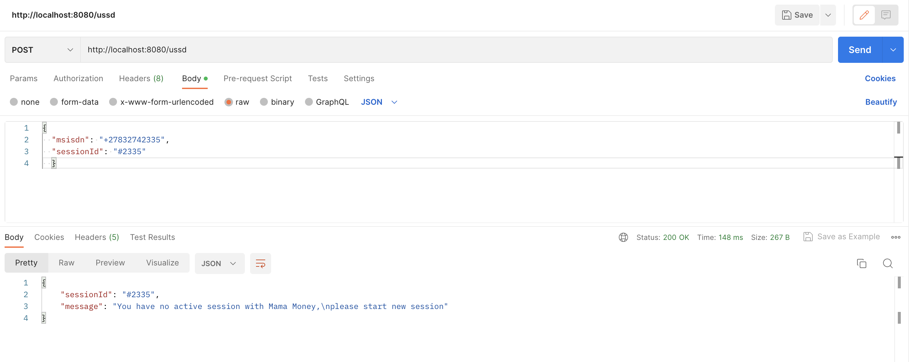

# Mama Money Ussd Service

Ussd service for sending payments to African countries

The instructions to run the code:
- `$ mvn clean install`
- In the root directory of the project, run:
  `$ docker-compose up --build`

There are initialization scripts which are critical to the running of this service, this file is called `init.sql` and can be found in the root directory of this project. These will give you an idea of how the database is structured.

Ensure that both the mysqldb & spring-boot applications are bot up and running. Run:
`$ docker ps`
```
d2d801c06f91   ussd-service-app   "java -jar /app.jar"     23 minutes ago   Up 23 minutes   0.0.0.0:8080->8080/tcp, :::8080->8080/tcp              ussd-service-app-1
d186622fab7f   mysql:5.7          "docker-entrypoint.s…"   23 minutes ago   Up 23 minutes   0.0.0.0:3306->3306/tcp, :::3306->3306/tcp, 33060/tcp   ussd-service-mysqldb-1
```
To connect to the mysqldb container and view the mysql database
```
wkhowa@wkhowa-mac ussd-service % docker exec -it ussd-service-mysqldb-1 bash
bash-4.2# mysql -u root -padmin
mysql: [Warning] Using a password on the command line interface can be insecure.
Welcome to the MySQL monitor.  Commands end with ; or \g.
Your MySQL connection id is 13
Server version: 5.7.43 MySQL Community Server (GPL)

Type 'help;' or '\h' for help. Type '\c' to clear the current input statement.

mysql> use ussd;
Reading table information for completion of table and column names
You can turn off this feature to get a quicker startup with -A

Database changed
mysql> show tables;
+-----------------------+
| Tables_in_ussd        |
+-----------------------+
| country               |
| foreign_exchange_rate |
| prompt                |
| session               |
| transaction           |
+-----------------------+
5 rows in set (0.01 sec)

mysql> select * from session;
+----+---------------------+--------------+---------------------------------------------------------------+---------------------+---------------------+-----------+
| id | session_external_id | msisdn       | prompt_response                                               | create_date         | last_modified_date  | status    |
+----+---------------------+--------------+---------------------------------------------------------------+---------------------+---------------------+-----------+
|  4 | #2335               | +27832742335 | {"amount": 15250, "country": "Kenya", "confirmation": "OK"}   | 2023-08-17 14:07:47 | 2023-08-17 14:09:51 | COMPLETED |
|  5 | #2336               | +27832742335 | {"amount": 108375, "country": "Malawi", "confirmation": "OK"} | 2023-08-17 14:10:03 | 2023-08-17 14:10:31 | COMPLETED |
|  6 | #2337               | +27832742335 | {"amount": null, "country": null, "confirmation": null}       | 2023-08-17 14:18:05 | 2023-08-17 14:18:05 | ACTIVE    |
+----+---------------------+--------------+---------------------------------------------------------------+---------------------+---------------------+-----------+
3 rows in set (0.00 sec)

mysql> select * from transaction;
+----+------------+---------------+-----------------+----------------------+------------+---------+---------------------+---------------------+--------+
| id | session_id | source_msisdn | source_currency | destination_currency | amount     | country | create_date         | last_modified_date  | status |
+----+------------+---------------+-----------------+----------------------+------------+---------+---------------------+---------------------+--------+
|  1 |          4 | +27832742335  | ZAR             | KES                  |   93025.00 | Kenya   | 2023-08-17 14:09:51 | 2023-08-17 14:09:51 | PAID   |
|  2 |          5 | +27832742335  | ZAR             | MWK                  | 4605937.50 | Malawi  | 2023-08-17 14:10:31 | 2023-08-17 14:10:31 | PAID   |
+----+------------+---------------+-----------------+----------------------+------------+---------+---------------------+---------------------+--------+
2 rows in set (0.01 sec)

mysql> select * from foreign_exchange_rate;
+----+-----------------+----------------------+-------+---------------------+---------------------+--------+
| id | source_currency | destination_currency | rate  | create_date         | last_modified_date  | status |
+----+-----------------+----------------------+-------+---------------------+---------------------+--------+
|  1 | ZAR             | KES                  |  6.10 | 2023-08-17 14:08:22 | 2023-08-17 14:08:22 | ACTIVE |
|  2 | ZAR             | MWK                  | 42.50 | 2023-08-17 14:08:22 | 2023-08-17 14:08:22 | ACTIVE |
+----+-----------------+----------------------+-------+---------------------+---------------------+--------+
2 rows in set (0.01 sec)


mysql> exit;
```

to list the containers and both containers should show up

The swagger-ui can be found on http://localhost:8080/swagger-ui.html where you can perform various API calls

# Testing

1. USSD Initialization
* WASP forwards a new request with new sessionId & msisdn an initialises the ussd session:
```
{
  "msisdn": "+27832742335",
  "sessionId": "#2335"
}
```
Response:


The correct response with the first USSD message is returned.

2. USSD Amount screen
* The user responds by sending either option 1 or 2. In this case, they responded with 1:
```
{
  "msisdn": "+27832742335",
  "sessionId": "#2335",
  "userEntry": "1"
}
```
Response:


3. USSD Disconnect & Resume Session
* The user gets disconnected from the session and dials the ussd string again. The WASP server doesn't know where the person left off, so it initializes the ussd session again:
```
{
  "msisdn": "+27832742335",
  "sessionId": "#2335"}
```
Response
The user is taken to the screen where they left off


4. USSD Amount Screen
* The user enters the amount to be sent in Rands:
```
{
  "msisdn": "+27832742335",
  "sessionId": "#2335",
  "userEntry": "2500"
}
```
Response:
The user is shown a confirmation message displaying the correct amount and currency (after currency conversion)


5. USSD Confirmation Screen
* The user is prompted to confirm their transaction:
```
{
  "msisdn": "+27832742335",
  "sessionId": "#2335",
  "userEntry": "1"
}
```
Response:
The user is shown a confirmation message displaying the goodbye message


6. USSD Error Screen
* If WASP mistakenly submits a sessionId that has a session that is in a COMPLETED state, an error message will be shown:
```
{
  "msisdn": "+27832742335",
  "sessionId": "#2335"
}
```
Response:
The user is shown an error message as shown below



# Stopping The Application
When done running the application, you can stop it as follows:
`$ docker-compose down`

In order to delete the db volume and network, run the command with the -v flag:
`$ docker-compose down -v`